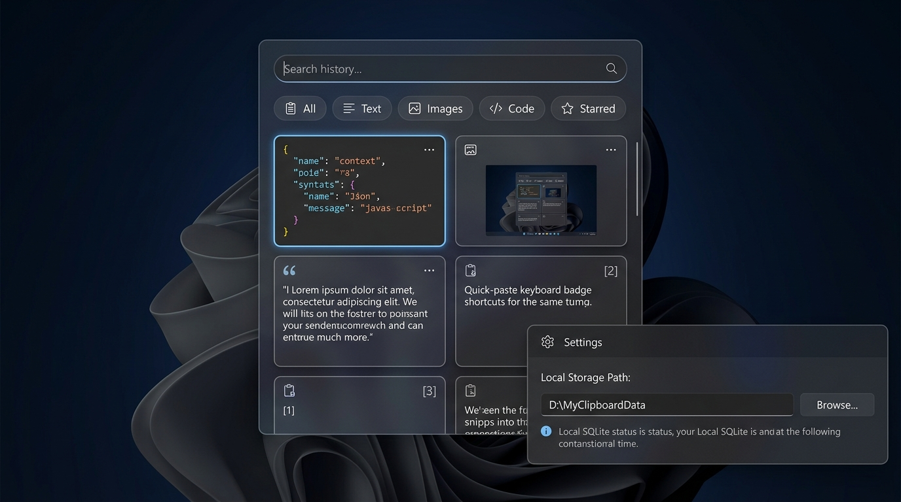

<div align="center">

# CopyBox 📦

**面向 Windows 10 / 11 的现代化、100% 纯本地离线、隐私优先剪贴板管理器。**  
*A blazingly fast, privacy-first, 100% local clipboard manager for Windows 10/11 built with modern .NET 8 & Fluent Design.*

[](https://dotnet.microsoft.com/)
[](https://microsoft.com/windows)
[](LICENSE)
[](#)

[ **简体中文** ](#-简体中文) | [ **English** ](#-english)

</div>

---

<p align="center">
  
</p>

---

# 🇨🇳 简体中文

## 🌟 为什么选择 CopyBox？

Windows 自带的剪贴板历史经常在关键时刻呼出迟缓、图片加载卡顿、缺少快速搜索和常用内容置顶功能；而市面上许多第三方剪贴板工具要么体积庞大（基于 Electron 动辄占用 200MB+ 内存），要么强制捆绑云端同步，让密码、Token、代码凭证等高敏感数据面临泄露风险。

**CopyBox 的设计初衷：**
1. **绝对隐私，100% 本地离线**：不发起任何网络请求、不收集任何遥测数据，所有剪贴板记录物理留存于用户本地磁盘。
2. **用户自选保存路径**：你可以自由指定本地存储位置。将路径设置为你的 **OneDrive / Dropbox / 坚果云** 目录，即可零门槛享受私有且安全的跨端同步！
3. **原生 Windows 11/10 现代美学**：1:1 还原 Fluent 现代卡片设计，双列卡片布局、自适应明亮与暗黑主题、精致微阴影。
4. **毫秒级弹出与全键盘流**：微型低占用常驻进程，按下 `Alt + V` 瞬间唤醒，支持数字键 `1~9` 直接秒贴。
5. **完整双语国际化支持**：原生内置简体中文与 English，界面、设置与提示无缝即时切换。

---

## ✨ 核心特性

- **🗂️ 1:1 现代双列卡片排版**：
  - **代码片段**：内置 Cascadia Code / Consolas 语法高亮卡片质感，自动识别 JSON 与各类程序语言。
  - **图片预览**：圆角缩略图自适应显示，截图高清无缝预览。
  - **纯文本**：优雅段落排版与来源程序低调标识。
- **🖱️ 丝滑便捷的交互体验**：
  - **右键上下文菜单**：在任意卡片上右键单击即可立即高亮选中，并在光标处呼出功能菜单。
  - **右上角快捷操作**：与卡片右上角“···”按钮功能 100% 同步，向左内收展开，完美贴合卡片。
  - **核心操作三合一**：
    - `★` **置顶 / 取消置顶**：暖金星号高亮，置顶卡片始终优先排列在顶部。
    - `❐` **复制到剪贴板**：一键写入系统剪贴板，带有智能防循环过滤与轻量 Toast 提示。
    - `✕` **删除此条记录**：从本地 SQLite 数据库中物理删除。
- **⚙️ 规整且可独立拖拽的设置面板**：
  - **窗口内自由拖拽**：按住设置面板标题栏抓手，即可在主窗口内部自由移动，内置智能边界算法，绝不超出窗口可视边缘。
  - **三层式固定架构**：固顶拖拽栏 + 中间紧凑滚动区 + 固底操作栏，“完成”与“彻底退出”按钮永远可见，绝不被截断。
  - **刀锋级高清文本渲染**：分离阴影层与内容层，彻底消除 WPF Shader 造成的文字发虚发糊，文字享受原生 ClearType 亚像素级超清显示。
- **🌐 深度国际化 (i18n)**：
  - 完美适配 `简体中文` 与 `English`，支持在设置面板中实时一键切换。
- **💾 高性能本地引擎**：
  - 采用 **SQLite + WAL 并发日志模式**，高频复制写入时悬浮窗零卡顿、零锁死。
  - 图片与数据库分治存储：数据库仅存元数据与哈希索引，图片独立存放，轻盈且检索飞快。

---

## ⌨️ 快捷键速查

| 快捷键 | 作用说明 |
| :--- | :--- |
| `Alt + V` | 全局任意界面快速呼出 / 隐藏 CopyBox |
| `1` ~ `9` 或 `Alt + 1~9` | 直接秒贴前 1~9 条对应历史内容 |
| `↑` / `↓` | 在卡片列表中上下快速导航移动 |
| `Enter` | 选定当前卡片并自动贴入目标窗口光标处 |
| `Del` | 物理删除当前选中的历史条目 |
| `P` | 将当前条目切换置顶状态 (Pin / Unpin) |
| `Apps` 或 `Shift + F10` | 呼出当前选中卡片的功能菜单 |
| `Esc` | 瞬间收起并隐藏窗口 |

---

## 🛠️ 技术栈

- **开发平台**：[.NET 8.0 SDK](https://dotnet.microsoft.com/)
- **UI 框架**：WPF (.NET 8 Windows Desktop)
- **底层互操作**：Win32 API (`AddClipboardFormatListener`, `RegisterHotKey`, `SendInput`, `SetForegroundWindow`)
- **本地数据库**：`Microsoft.Data.Sqlite` (WAL 并发模式)
- **系统托盘**：原生 Windows Forms `NotifyIcon` 托盘集成

---

## 🚀 快速上手与本地编译

### 1. 环境准备
确保您的计算机已安装 [.NET 8 SDK](https://dotnet.microsoft.com/download/dotnet/8.0)。

### 2. 克隆项目并编译
```bash
git clone https://github.com/1Than499/CopyBox.git
cd CopyBox/ClipVault
dotnet build -c Release
```

### 3. 发布单文件免安装便携版 (Single-File Release)
```bash
dotnet publish -c Release -r win-x64 --self-contained false -p:PublishSingleFile=true -o ../publish/
```
生成的单文件独立运行程序将输出至 `publish/CopyBox.exe`。

---

## 📁 本地数据目录结构

当你自定义保存路径（例如 `D:\CopyBoxData\`）后，CopyBox 会在本地维护以下清晰结构：

```text
D:\CopyBoxData\
├── clipboard.db          # SQLite 索引与元数据 (文本内容、来源应用、字符数、置顶标记等)
├── clipboard.db-shm      # SQLite WAL 共享内存索引
├── clipboard.db-wal      # SQLite 高性能预写日志
└── images/               # 截图与图片独立缓存目录 (sha256_hash.png)
```

---

<br/>

# 🇺🇸 English

## 🌟 Why CopyBox?

Windows' built-in clipboard history often suffers from slow popups, laggy image rendering, and a lack of search and pinning features. Meanwhile, many third-party clipboard utilities are either bloated (Electron-based apps consuming 200MB+ RAM) or force cloud synchronization, exposing sensitive passwords, tokens, and code snippets to leakage risks.

**CopyBox is built with clear principles:**
1. **100% Offline & Private**: Zero network requests, zero telemetry tracking. All clipboard data physically resides on your local device.
2. **User-Configurable Storage Path**: Freedom to store your data wherever you want. Setting the storage directory to **OneDrive / Dropbox / Nutstore** gives you private, self-hosted cross-device sync with zero configuration!
3. **Native Windows 11/10 Fluent Aesthetics**: 1:1 pixel-accurate modern Fluent card design, two-column layout, adaptive light/dark themes, and delicate soft shadows.
4. **Sub-millisecond Popup & Full-Keyboard Flow**: Lightweight background daemon. Press `Alt + V` for instant wake-up; use number keys `1~9` for instant pasting.
5. **Full Bilingual Support**: Native Simplified Chinese and English support with instantaneous switching.

---

## ✨ Key Features

- **🗂️ 1:1 Modern Two-Column Card Layout**:
  - **Code Snippets**: Built-in Cascadia Code / Consolas syntax highlighting with code card styling. Automatic JSON and language detection.
  - **Image Previews**: Adaptive rounded thumbnails for instant image inspection.
  - **Plain Text**: Elegant multi-line typography with discreet source process badges.
- **🖱️ Smooth & Intuitive Interactions**:
  - **Right-Click Context Menu**: Right-click any card to select with glow feedback and summon the menu at your cursor.
  - **Top-Right Quick Actions**: 100% synchronized with the card's top-right `···` button, expanding smoothly without overlapping adjacent cards.
  - **Three Core Actions**:
    - `★` **Pin / Unpin**: Warm golden star highlight; pinned cards always stay at the top.
    - `❐` **Copy to Clipboard**: Copy with self-monitoring loop protection and subtle toast alerts.
    - `✕` **Delete Item**: Permanently remove from the local SQLite database.
- **⚙️ Draggable & Well-Organized Settings Overlay**:
  - **In-Window Free Dragging**: Grab the title bar handle to move the settings panel anywhere inside the client area with intelligent boundary protection.
  - **Three-Tier Fixed Architecture**: Pinned header + compact scroll body + pinned footer. Action buttons ("Done" and "Exit") are never cropped.
  - **Razor-Sharp ClearType Text Rendering**: Separated shadow layer and content container, eliminating blur caused by WPF pixel shaders.
- **🌐 Seamless Internationalization (i18n)**:
  - Full translations for `简体中文` (Simplified Chinese) and `English`.
- **💾 High-Performance Local Engine**:
  - Powered by **SQLite with WAL (Write-Ahead Logging)** mode for lightning-fast concurrent read/write.
  - Segregated image storage: High-resolution bitmaps are stored separately by SHA-256 hash, keeping database files light and fast.

---

## ⌨️ Keyboard Shortcuts Reference

| Shortcut | Description |
| :--- | :--- |
| `Alt + V` | Globally toggle / hide CopyBox from any window |
| `1` ~ `9` or `Alt + 1~9` | Instantly paste items #1 through #9 |
| `↑` / `↓` | Navigate smoothly between cards |
| `Enter` | Select and paste item directly into active cursor position |
| `Del` | Physically delete selected item |
| `P` | Toggle item pin status (Pin / Unpin) |
| `Apps` or `Shift + F10` | Open the context menu for selected item |
| `Esc` | Instantly dismiss and hide window |

---

## 🛠️ Technology Stack

- **Platform**: [.NET 8.0 SDK](https://dotnet.microsoft.com/)
- **UI Framework**: WPF (.NET 8 Windows Desktop)
- **Win32 Interop**: `AddClipboardFormatListener`, `RegisterHotKey`, `SendInput`, `SetForegroundWindow`
- **Database**: `Microsoft.Data.Sqlite` (WAL concurrency mode)
- **Tray Integration**: Native Windows Forms `NotifyIcon`

---

## 🚀 Getting Started & Local Build

### 1. Prerequisites
Ensure [.NET 8 SDK](https://dotnet.microsoft.com/download/dotnet/8.0) is installed on your machine.

### 2. Clone and Build
```bash
git clone https://github.com/1Than499/CopyBox.git
cd CopyBox/ClipVault
dotnet build -c Release
```

### 3. Publish Single-File Portable Release
```bash
dotnet publish -c Release -r win-x64 --self-contained false -p:PublishSingleFile=true -o ../publish/
```
The self-contained executable will be generated at `publish/CopyBox.exe`.

---

## 📁 Local Data Directory Structure

When specifying a custom path (e.g. `D:\CopyBoxData\`), CopyBox organizes files as follows:

```text
D:\CopyBoxData\
├── clipboard.db          # SQLite index & metadata (content, source app, timestamps, pin status)
├── clipboard.db-shm      # SQLite WAL shared memory index
├── clipboard.db-wal      # SQLite high-performance write-ahead log
└── images/               # Image cache folder (sha256_hash.png)
```

---

## 🤝 License

This project is licensed under the [MIT License](LICENSE).
